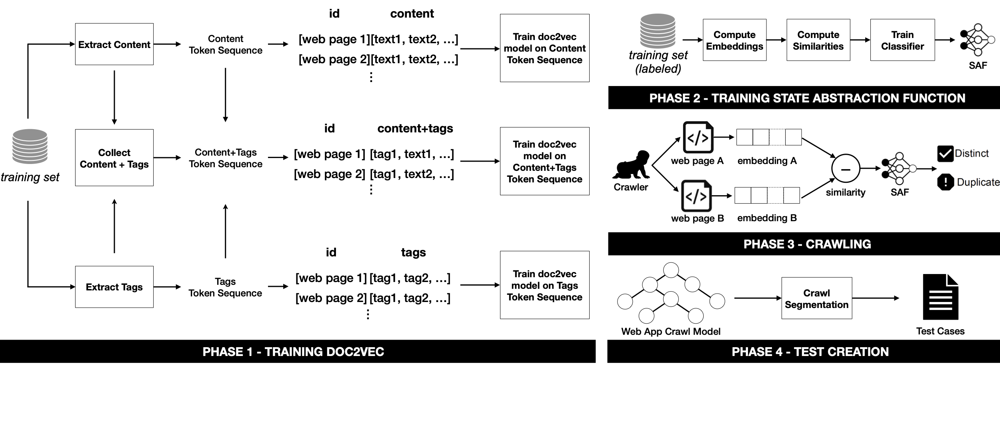

# Neural Embeddings for Web Testing

Artifacts accompanying the paper *"Neural Embeddings for Web Testing"* submitted for publication at the IEEE Transactions on Software Engineering (TSE).

## Overview

Our tool WebEmbed leverages the neural embedding by Doc2Vec and turn them into a similarity 
score to automatically predict near-duplicate web pages. The figure below shows the approach.



## Dependencies

**Software setup:** We adopted the PyCharm Professional 2020.3, a Python IDE by JetBrains.

First, you need [anaconda](https://www.continuum.io/downloads) or [miniconda](https://conda.io/miniconda.html) installed on your machine. Then, you can create and install all dependencies on a dedicated virtual environment, by running one of the following commands, depending on your platform.

```python
# macOS
conda env create -f webembed/environments.yml 

# Windows
conda env create -f webembed\windows.yml
```

Alternatively, you can manually install the required libraries (see the contents of the *.yml files) using ```pip```.

**Note:** Training the Doc2Vec models on our datasets is computationally expensive as it can be done only on a CPU. 

## Replicate experiments

### Datasets

Datasets, classifier models and results have a combined size of several GBs and cannot be versioned on GitHub. We will make all artifacts available upon paper's acceptance. 

### Evaluation Scripts

For replicating our results, evaluation scripts are present in the folder `webemdeb/script`.

A sample of results (RQ1/RQ2) is in the folder `webemdeb/csv_results_table`.
For RQ3, data are available in the folder `webemdeb/rq3` (PPMA and Dimeshift only)
